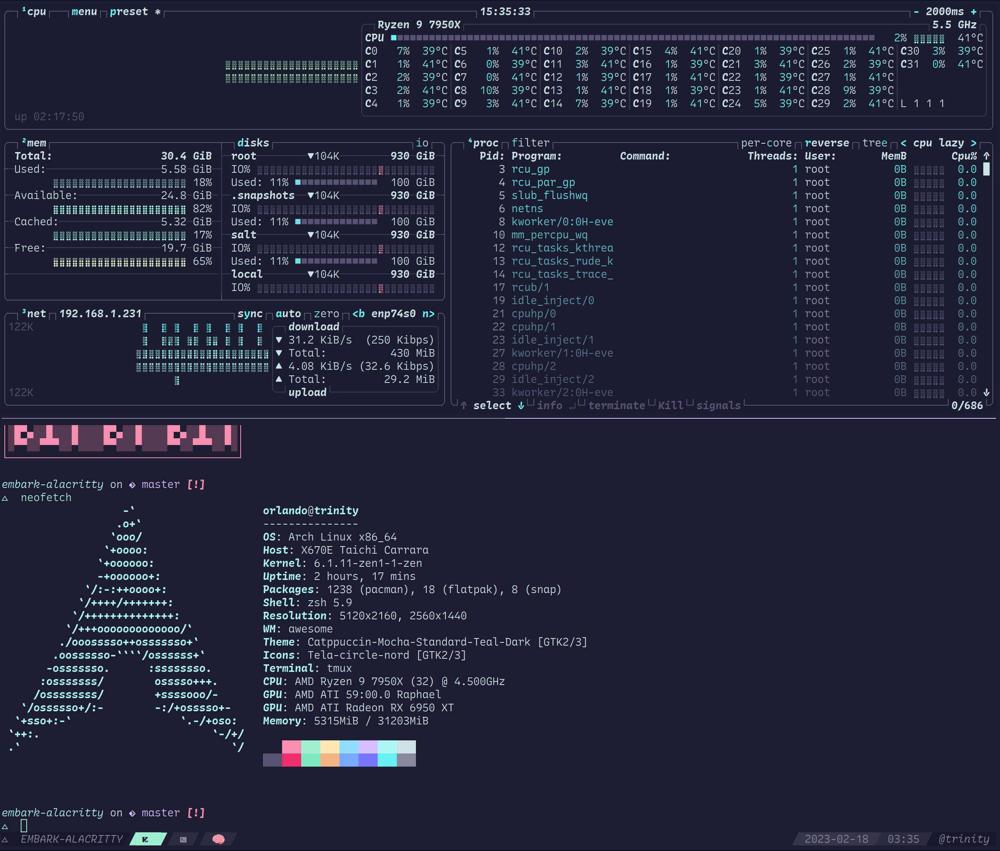

# alacritty
An ambitious theme for alacritty



## How to use

Edit alacritty configuration file (usually located at `$XDG_CONFIG_HOME/alacritty/alacritty.yml`) and import embark to your config.
If you placed `embark.yml` into `$XDG/alacritty/alacritty/themes/embark.yml` then
the import would look like the following:

```
import:
  - ~/.config/alacritty/themes/embark.yml
```

### For Version: 0.13.0 or later use TOML instead of YML
```
import = [
  "~/.config/alacritty/themes/embark.toml"
]
```

> See [this](https://github.com/alacritty/alacritty-theme) repo for similar theme
> handling.
